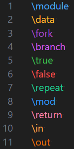

日本語版の README.md は <[こちら](README.md)>.

# About HCPWorks

HCPWorks is a VSCode extension that allows you to preview text files written in the HCP chart format.
It aims to streamline the HCP chart creation process by enabling you to complete it entirely within VSCode.

## Features

### Preview HCP Charts

#### Preview

Preview HCP charts.

1. Select a ".hcp" file.
1. Charts beginning with "\module" are listed.
1. Select any module.
1. The HCP chart is previewed.

#### Update Preview

Automatically update preview when file is saved.

1. Edit the previewed ".hcp" file.
1. Save the file.
1. The preview will update automatically.

#### Save

Save HCP charts.

1. Push the "Save" button displayed on the tab bar.  
The "Save" button will be displayed in the ".hcp" panel or the preview panel.
1. "SVG" images are saved.
1. The naming convention for the created SVG file is: \<fileName>_\<moduleName>.svg

### Support Syntax Highlight

This extension supports syntax highlighting as shown in the image below.

## HCP chart notation

- Indentation (4 spaces ∪ tab) based on HCP notation to express levels.
- Each notation described below starts with \\ (backslash) and continues up to the first space character.
- If it does not correspond to the list, it is treated as a simple string.
- A string starting with "#" is considered a comment to the end of the line.

### Notation that can be written at level 0

Notation | Content | Notes
---| --- | ---
\module | Start of module | Be sure to write it together with the module name.

### Notation that can be written at level 0 or higher

Notation | Content | Notes
---| --- | ---
\data | Definition of data used in the module | Do not define duplicate data names. If duplicates exist, only the first definition will be used for rendering.
\fork | Conditional branch | -
\true | If the condition of the conditional branch is true | There are no restrictions, but avoid writing two consecutive `\true` notations by mistake.
\false | If the condition of the conditional branch is false |There are no restrictions, but avoid writing two consecutive `\false` notations by mistake.
\branch | If the condition of the conditional branch is not true or false | -
\repeat | Repeat | -
\mod | Function call | -
\return | End of processing | -
### Notation that can be added to levels 0 and above

Notation | Content | Notes
---| --- | ---
\in | Input to processing/function | If written at the lowest indentation level, it is treated as input to the function.  If written at any level other than the lowest indentation level, it is treated as simple processing input.  If there is no definition in `\data`, it is treated as new data.  Do not include spaces or periods.
\out | Output from processing/function | If written at the lowest indentation level, it is treated as output from the function.  If written at any level other than the lowest indentation level, it is treated as simple processing output.  If there is no definition in `\data`, it will be treated as new data.  Do not include spaces or periods.

## Known Issues

For a list of known issues, please refer to our [GitHub issue tracker](https://github.com/in0ho1no/HCPWorks/issues).  
If you encounter any new problems, please report them as a new issue on GitHub.

## Release Notes

Check the [CHANGELOG](hcpworks/CHANGELOG.md).
