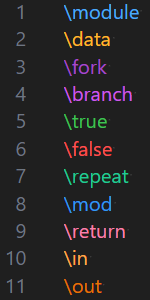

English version of README.md is <[here](README.en.md)>.

# HCPWorks について

HCPWorksは、HCPチャート形式で記述されたテキストファイルをプレビューできるVSCode拡張機能です。
HCPチャートの作成プロセスをVSCode内で完結できるようにすることで、効率化を目指しています。

## 機能

### HCP チャートのプレビュー

#### プレビュー

HCPチャートをプレビューします。

1. 「.hcp」ファイルを選択します。
1. 「\module」で始まるチャートが一覧表示されます。
1. 任意のモジュールを選択します。
1. HCP チャートがプレビューされます。

#### 再読み込み

ファイルを保存すると、プレビューが自動的に更新されます。

1. プレビューされた「.hcp」ファイルを編集します。
1. ファイルを保存します。
1. プレビューが自動的に更新されます。

#### 保存

HCPチャートを保存します。

1. タブバーに表示される保存用ボタンをクリックします。  
保存用ボタンは、".hcp"ファイルのパネルもしくはHCPチャートのプレビューパネルに表示されます。
1. "SVG"画像が保存されます。
1. SVG画像の命名規則は右記の通りです。: \<fileName>_\<moduleName>.svg

#### 描画レベルの指定

HCPチャートで描画するレベルを指定できます。

1. 描画したいレべルを入力します。 / 描画したいレべルをスピンボタンで指定します。  
1. 「描画レベル確定」をクリックします。  
1. プレビューが自動的に更新されます。  

### シンタックスハイライト

以下の画像に示すようにシンタックスハイライトをサポートしています。

## HCPチャートの記法

- HCPの記法に基づいてインデント(空白4つ∪タブ)でレベルを表現
- 後述の各表記は \\(バックスラッシュ)で始まり、半角スペースまで を判別する。
- 一覧に該当しない場合、単なる文字列として扱う。
- "#"から始まる文字列は、行の末尾までコメントとみなす。

### レベル0に記載できる表記

表記 | 内容 | 注意点
---| --- | ---
\module | モジュールの開始 | モジュール名とセットで必ず記載すること。

### レベル0以上に記載できる表記

表記 | 内容 | 注意点
---| --- | ---
\data | モジュール内で利用するデータの定義 | 重複させないこと。重複した場合、一番最初に登場する文字列のみ描画する。
\fork | 条件分岐 | -
\true | 条件分岐の条件が真の場合 | 制約ないので、trueを2つ連続して誤記載しないよう注意
\false | 条件分岐の条件が偽の場合 | 制約ないので、falseを2つ連続して誤記載しないよう注意
\branch | 条件分岐の条件が真偽以外の場合 | -
\repeat | 繰り返し | -
\mod | 関数呼び出し | -
\return | 処理の終了 | -

### レベル0以上に追加で記載できる表記

表記 | 内容 | 注意点
---| --- | ---
\in | 処理・関数への入力 | 最小レベルへ記載した場合、関数への入力として扱う。 最小レベル以外へ記載した場合、単なる処理の入力として扱う。 \dataに定義がない場合、新規のデータとして扱う。 空白文字・ピリオドを含まないこと。
\out | 処理・関数からの出力 | 最小レベルへ記載した場合、関数からの出力として扱う。 最小レベル以外へ記載した場合、単なる処理の出力として扱う。 \dataに定義がない場合、新規のデータとして扱う。 空白文字・ピリオドを含まないこと。

## 既知の問題

既知の問題は、[GitHubのissue](https://github.com/in0ho1no/HCPWorks/issues) をご覧ください。  
新たな問題が発生した場合は、GitHub で新しい問題として報告してください。

## リリースノート

[CHANGELOG](hcpworks/CHANGELOG.md) をご確認ください。
