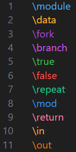

English version of README.md is <[here](README.en.md)>.

# HCPWorks について

HCPWorksは、HCPチャート形式で記述されたテキストファイルをプレビューできるVSCode拡張機能です。
HCPチャートの作成プロセスをVSCode内で完結できるようにすることで、効率化を目指しています。

## 機能

### HCP チャートのプレビュー

#### プレビュー

HCPチャートをプレビューします。

1. 「.hcp」ファイルを選択します。
1. 「\module」で始まるチャートが一覧表示されます。
1. 任意のモジュールを選択します。
1. HCP チャートがプレビューされます。

#### 再読み込み

ファイルを保存すると、プレビューが自動的に更新されます。

1. プレビューされた「.hcp」ファイルを編集します。
1. ファイルを保存します。
1. プレビューが自動的に更新されます。

#### 保存

HCPチャートを画像として保存します。

1. タブバーに表示される保存用ボタンをクリックします。  
保存用ボタンは、HCPチャートのプレビューパネルに表示されます。
1. 出力形式を選択します。以下の4形式から選べます。
    - PNG: 標準。文字や線をきれいに出力したい場合に適している。
    - SVG: 拡大・再編集向け。線や図形を劣化なく扱える。
    - WebP: 軽量化向け。環境によっては表示できない場合がある。
    - JPEG: 非可逆圧縮。文字や細線は滲みやすい。
1. 選択した形式で画像が保存されます。PNG / WebP / JPEG は2倍解像度でラスタライズされます。
1. 画像の命名規則は右記の通りです。: \<fileName>_\<moduleName>.\<拡張子>

#### 描画レベルの指定

HCPチャートで描画するレベルを指定できます。

1. 描画したいレべルを入力します。 / 描画したいレべルをスピンボタンで指定します。  
1. 「描画レベル確定」をクリックします。 / 入力欄でEnterキーを押します。  
1. プレビューが自動的に更新されます。  

### シンタックスハイライト

以下の画像に示すようにシンタックスハイライトをサポートしています。

## HCPチャートの記法

- HCPの記法に基づいてインデント(空白4つ∪タブ)でレベルを表現
- 後述の各表記は \\(バックスラッシュ)で始まり、半角スペースまで を判別する。
- 一覧に該当しない場合、単なる文字列として扱う。
- "#"から始まる文字列は、行の末尾までコメントとみなす。

### レベル0に記載できる表記

表記 | 内容 | 注意点
---| --- | ---
\module | モジュールの開始 | モジュール名とセットで必ず記載すること。
\kind | モジュールの変更種別 | \moduleから\tableまでの間に記載すること。値は自由記述(例: 新規作成 / 既存変更 / 既存流用)。Name:の下に `kind: 値` の形式で表示し、画像にも含まれる。
\scope | モジュールの公開種別 | \moduleから\tableまでの間に記載すること。値は自由記述(例: 公開関数 / 非公開関数、extern / static)。Name:の下に `scope: 値` の形式で表示し、画像にも含まれる。
\table | 表の記載 | \moduleから\dataの間に記載すること。csv形式で、連続するカンマは1つにまとめる。 `\table 名前` でキャプションを付けられる。 行頭インデント(タブ/半角4スペース=1階層)で構造体メンバのような親子階層を表現できる。 セル内で改行したい場合は ` ` を使う(Excelへは書式あり貼り付けでセル内改行になる)。 画像の出力には含めない。

### レベル0以上に記載できる表記

表記 | 内容 | 注意点
---| --- | ---
\data | モジュール内で利用するデータの定義 | 重複させないこと。重複した場合、一番最初に登場する文字列のみ描画する。
\fork | 条件分岐 | -
\true | 条件分岐の条件が真の場合 | 制約ないので、trueを2つ連続して誤記載しないよう注意
\false | 条件分岐の条件が偽の場合 | 制約ないので、falseを2つ連続して誤記載しないよう注意
\branch | 条件分岐の条件が真偽以外の場合 | -
\repeat | 繰り返し | -
\mod | 関数呼び出し | -
\return | 処理の終了 | -

### レベル0以上に追加で記載できる表記

表記 | 内容 | 注意点
---| --- | ---
\in | 処理・関数への入力 | 最小レベルへ記載した場合、関数への入力として扱う。 最小レベル以外へ記載した場合、単なる処理の入力として扱う。 \dataに定義がない場合、新規のデータとして扱う。 空白文字・ピリオドを含まないこと。
\out | 処理・関数からの出力 | 最小レベルへ記載した場合、関数からの出力として扱う。 最小レベル以外へ記載した場合、単なる処理の出力として扱う。 \dataに定義がない場合、新規のデータとして扱う。 空白文字・ピリオドを含まないこと。
\drop | 出力データの読み捨て | \outと同様に記載するが、データ部とは接続せず描画もしない。 読み捨てる出力を注記する用途。 空白文字・ピリオドを含まないこと。

### 文字列の装飾

行中の文字列の一部を装飾できます。`\mod` などの行種別と組み合わせて使えます。 各タグは対(`<del></del>` / `<ins></ins>`)で使用します。タグの入れ子・別タグの混入・対応しない開閉は記法エラーとして赤背景で表示します。

記法 | 内容 | 注意点
---| --- | ---
`<del>～</del>` | 見え消し(取り消し線) | `<del>` と `</del>` で囲った範囲に取り消し線を引き、背景をサーモンピンクで塗る。 例: `\mod <del>送信する</del>受信解析する` 装飾タグ自体は描画しない。
`<ins>～</ins>` | 追加・変更(ハイライト) | `<ins>` と `</ins>` で囲った範囲の背景をライトグリーンで塗り、新規追加・変更箇所を示す。 例: `\mod <ins>受信解析する</ins>` 装飾タグ自体は描画しない。

## 設定

VSCodeの設定（`ファイル > ユーザー設定 > 設定` で "HCPWorks" を検索）から以下の項目を変更できます。

設定キー | 型 | デフォルト | 説明
--- | --- | --- | ---
`hcpworks.SvgBgColor` | string | `FFFFFF` | プレビュー・エクスポートのSVG背景色（RRGGBB形式）。
`hcpworks.WireColorTable` | string[] | （8色） | ワイヤーの色テーブル（RRGGBB形式の配列）。
`hcpworks.headerDisplay.showName` | boolean | `true` | `Name:` フィールドをプレビュー・エクスポートに表示するかどうか。
`hcpworks.headerDisplay.showScope` | boolean | `true` | `scope:` フィールドをプレビュー・エクスポートに表示するかどうか。
`hcpworks.headerDisplay.showKind` | boolean | `true` | `kind:` フィールドをプレビュー・エクスポートに表示するかどうか。

## 既知の問題

既知の問題は、[GitHubのissue](https://github.com/in0ho1no/HCPWorks/issues) をご覧ください。  
新たな問題が発生した場合は、GitHub で新しい問題として報告してください。

## リリースノート

[CHANGELOG](hcpworks/CHANGELOG.md) をご確認ください。
